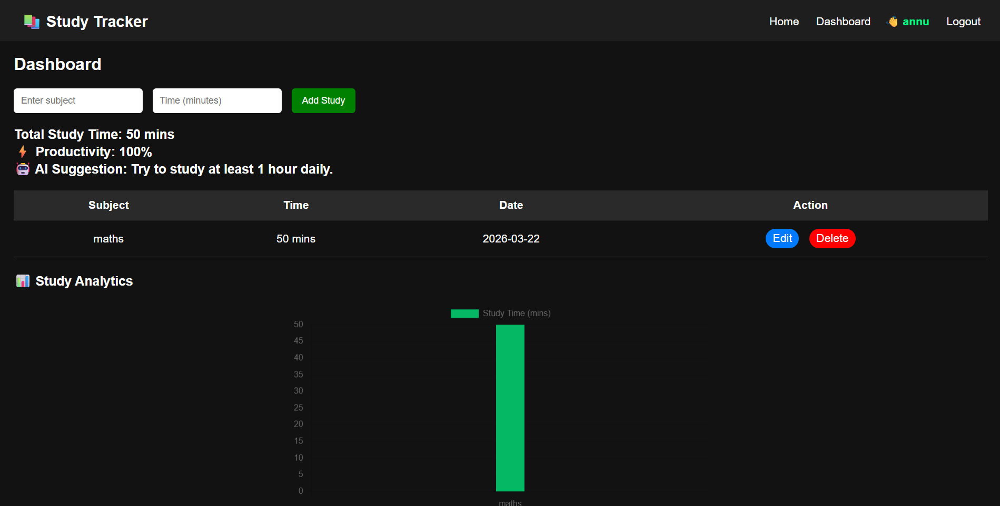

# 💻 Personal Portfolio Website

A modern and interactive personal portfolio built using **HTML, CSS, and JavaScript**.  
It showcases my projects, skills, and contact information with a clean UI and smooth animations.

---

## 🚀 Live Demo

🌐 https://annu-portfolio-rose.vercel.app/

---

## ✨ Features

- 🎨 Modern UI with glassmorphism effect
- 💗 Pink-themed design with smooth hover effects
- 🌌 Particle background animation
- 🖱️ Custom cursor glow effect
- ⚡ Smooth scrolling and animations
- 📱 Fully responsive (mobile-friendly)
- 📂 Projects showcase with live links & GitHub
- 📩 Contact section with social links

---

## 🛠️ Tech Stack

- HTML5
- CSS3
- JavaScript
- Particles.js

---

## 📂 Sections Included

- 🏠 Home (Hero section)
- 👩‍💻 About Me
- 💡 Skills
- 🚀 Projects
- 📩 Contact
- 📝 Footer

---

## 📸 Screenshots

